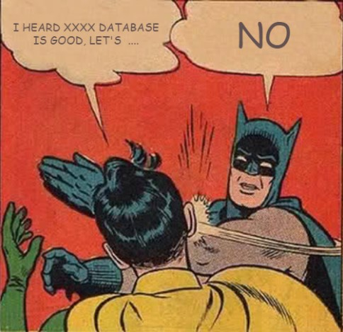

Changing database technology is very difficult decision when coming to modernizing a legacy product. Don't believe me? Try asking your DBA about changing existing database technology and see what you get ;)




Recently this article - [TimescaleDB 2.0: A multi-node, petabyte-scale, completely free relational database for time-series](https://blog.timescale.com/blog/timescaledb-2-0-a-multi-node-petabyte-scale-completely-free-relational-database-for-time-series/),  came into my radar when finding solution for time series database. It is basically a plugin that sits on top of Postgres DB. Now, you can tell your DBA to keep calm as we will only install an extra plugin into the DB to boost up the performance on time series data use case. I spend a few days to carry out some research about this database (so I'm not a an TimescaleDB expert, take my understanding and opinion with some salt) Let's look into some concept/magic that TimescaleDB did to speed up PostgrestDB.


# Setup


TimescaleDB installation is pretty straightforward. Follow the [installation guide](https://docs.timescale.com/timescaledb/latest/how-to-guides/install-timescaledb/) and [post-install setup guide](https://docs.timescale.com/timescaledb/latest/how-to-guides/install-timescaledb/post-install-setup/) from the documentation. This can be done in 15 minutes. 


Instead, if you don't want to install TimescaleDB, you can register a free trial account from [Timescale Cloud](https://www.timescale.com/cloud), a managed service from Timescale that allow you to spin up in different cloud provider like  AWS / Azure / GCP. 


# Hypertable 

Database table that we will interact in Timescale is not an ordinary plain table but an abstraction layer called, hypertable. When data loaded to the table, TimescaleDB will automatically create partition and divide these data into chunks. Chunks are created by partitioning data into one (or potentially multiple - *time & space* partitions) dimensions. In **single dimension hypertable**, data are partition by **time column** that specified by the user; while in **multiple dimension hypertable** user can further partition the data by **additional column** e.g. a device identifier, server or container id, user or customer id, location, stock ticker symbol, and so forth. However, it is **recommended to stick with only one dimension** (time partitioning) if the TimescaleDB setup is **single node**. 





**All these chunking and partitioning mechanisms are transparent to database user.** As hypertable is an abstraction or virtual view of many individual tables, the user will see one hypertable and perform operations on it.


### Create Hypertable

Let's do some practical stuff by creating a hypertable.


1. Create normal SQL table.

   ```sql
   CREATE TABLE public.card (
   	cardno varchar NULL,
   	transactionamount float4 NULL,
   	datetime timestamp NULL
   );
   ```


2. Create the hypertable

   ```sql
   SELECT create_hypertable('card','datetime',
                            chunk_time_interval => INTERVAL '1 day');
   ```

3. Load data into hypertable by normal `INSERT` or `LOAD` SQL command.

4. After loaded some data, you can list out the chunk created.

   ```sql
   SELECT show_chunks('public.card')
   ```

   **Result:**

   

   

5. To understand more how the data being stored and chunked, you can query the chunk.

   ```sql
   SELECT *
   FROM _timescaledb_internal._hyper_3_7_chunk
   LIMIT 10
   ```


<br/>

### Query Optimization


When we perform any query, TimescaleDB will try to analyze the SQL query and only **query the related chunks**. Let's see this in practice. 

Below is my distinct date (*in day*) in my database. 

```sql
SELECT DISTINCT (DATE_TRUNC('day', datetime))
FROM card 
```

 

<br/>

Do some simple query operation like count the data size in our hypertable.

```sql
SELECT count(*)
FROM card 
```

**Result:**



<br/>


Further filter by date (`datetime > '2020-07-09'`). 

```
SELECT COUNT(*)
FROM card 
WHERE datetime > '2021-07-09'
```

**Result:**



<br/>


Further filter by date (`datetime > '2020-07-15'`). 

```
SELECT COUNT(*)
FROM card 
WHERE datetime > '2021-07-15'
```

**Result:**



<br/>


Notice that the time taken to run the query reduce from **951ms** -> **493ms** -> **0.6ms**. How can this is possible? Aren't we running the query against ~40 million data. Let run the `EXPALIN` SQL command to understand more.

Without filter:




Filter by `datetime > '2020-07-09'`:




Filter by `datetime > '2020-07-15'`:




TimescaleDB has added some optimization logic in SQL planning process, it will **<u>only perform the SQL query on the related chunk</u>** instead of performing it on all the data. This optimization reduces the size of data to be processed and thus the query performance increased. 


# Continuous Aggregation

Aggregation is the most troublesome issue when dealing with time-series data because of the huge data volume. TimescaleDB can continuously compute the required aggregated value, thus we do not need to keep all the data in the database. This feature is quite similar with Postgres's [materialized view](https://www.postgresql.org/docs/current/rules-materializedviews.html), but has extra capability to **incremental refresh the value**. TimescaleDB **does not re-calculate all of the data** on every refresh, only **new and/or invalidated data will be calculated**. 

This can be extremely useful in the situation when you have a bunch of data that will not change much over the time and you have frequent query that required to aggregate them. Instead with continuous aggregation, you can aggregate the value one-off and query the result subsequently to speed up the performance.


 There is two type of continuous aggregation in TimescaleDB : 

- Non real-time aggregation
- Real-time aggregation 


### Real-time vs Non Real-time 

Before real-time aggregation being introduced, the value return by continuous aggregation will only refresh according to the time specified in the policy for the worker to run.




If the worker being scheduled to run every 6 hours, then very likely you will be getting outdated value from the materialized view.  To solve this issue, TimescaleDB introduced real-time aggregation that will return a pre-calculated materialized view that combined with the latest raw data available at query time. With such functionality, we can ensure the value returned is always up-to-date.




### Create Continuous Aggregation

```sql
-- Create materialized view
CREATE MATERIALIZED VIEW cardNumberOfTransactionsMoreThan300
WITH (timescaledb.continuous)
AS
SELECT
   time_bucket('1 hour', datetime) as bucket,
   cardno,
   count(*) as count
FROM card
WHERE transactionamount >= 300
AND transactionamount  < 500
GROUP BY bucket, cardno 
with no data;


-- Create policy 
SELECT add_continuous_aggregate_policy('cardNumberOfTransactionsMoreThan300',
    start_offset => NULL,
    end_offset => INTERVAL '10s',
    schedule_interval => INTERVAL '10s');


-- Check for worker job statistic 
SELECT * FROM timescaledb_information.job_stats;


-- query materialized view
SELECT * FROM cardNumberOfTransactionsMoreThan300;


-- disbale real-time aggregation
ALTER materialized VIEW cardNumberOfTransactionsMoreThan300
SET (timescaledb.materialized_only = false)


-- delete materialized view
DROP MATERIALIZED VIEW cardNumberOfTransactionsMoreThan300

```


### Windowing Function 

We have discussed about how to perform continuous aggregation in the time window/bucket. However, the result accuracy will be different according to the window function we used. Let's look into the window function that we can archive with TimescaleDB.

- **Tumbling Window**

  In tumbling window, data stream is segmented into **one distinct time segment** which does not overlap. One event record can belong to only 1 tumbling window, no data overlapping is allowed across the windows.

  

  

- **Sliding Window** 

  In sliding window, data stream is segmented into **multiple time segment**. In another word, sliding windows allow duplication data across the window.

  

<br/>

By design, continuous aggregation is tumbling window and ***does not support sliding window***. To achieve this we need to implement the sliding window logic in our SQL query. 


Example:

> Count the **number of transactions** that more than $300 of a **specific card number** in last 24 hours starting from the given **time** (*2021-07-04 05:30:00*).


 We will need to perform **2 query** and union the returned results:

**Query 1 - Query bucket values**

Query the aggregated value from the continuous aggregation materialized view.


**Query 2 - Query partial value**

Query the partial value from raw data table.





**SQL Query**

```sql
SELECT sum(x.transcationCount) as totalTransactionCount FROM
(
  SELECT  sum(count) as transcationCount
  FROM cardNumberOfTransactionsMoreThan300
  WHERE bucket > '2021-07-07 12:00:00'
  and cardno ='XXXXXXXXX111XXXX509'
  union
  SELECT count(*) as transcationCount
  FROM card
  WHERE datetime between '2021-07-07 11:29:00' and '2021-07-07 12:00:00'
  AND transactionamount >= 300
  AND transactionamount  < 500
  AND cardno ='XXXXXXXXX111XXXX509'
 ) as x
```


# Conclusion 

TimescaleDB is a very powerful database that purpose built for time series data. 


However, if your use case required high concurrency and  heavy read & write, then you might want to reconsider as it is built on top of Postgres. During my POC project, I noticed that when I have high concurrency access toward the TimescaleDB, it's can't really perform very well and seem to be locked by the Postgres' ***LWLock***. 




*(This is my two cents understanding after play around with TimescaleDB for a week)*


<br/>

**Reference**

1. Hypertables - [link](https://docs.timescale.com/timescaledb/latest/overview/core-concepts/hypertables-and-chunks/##hypertables)
2. Getting Started With TimescaleDB and Defining Best Practices - [link](https://www.youtube.com/watch?v=c8_iHabi-nc&ab_channel=TimescaleDB)
3. TimescaleDB Hypertable - [link](https://kb.objectrocket.com/timescaledb/timescaledb-hypertable-1567)
4. SQL and TimescaleDB - [link](https://medium.datadriveninvestor.com/sql-and-timescaledb-e4676aac38a9)
5. Time series database analysis - [link](https://www.programmersought.com/article/93124401698/)
6. Continuous aggregates - [link](https://docs.timescale.com/timescaledb/latest/overview/core-concepts/continuous-aggregates/##continuous-aggregates) 
7. Introduction to Stream Analytics windowing functions - [link](https://docs.microsoft.com/en-us/azure/stream-analytics/stream-analytics-window-functions)

